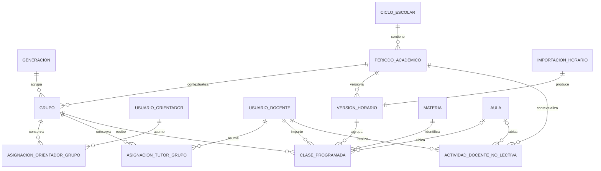

# Rediseño académico y de horarios

## 1. Estado de partida

COBAEM 30 parte de una base estable compatible con el esquema aplicado hasta la migración 008. Las migraciones 009 y 011–014 están rastreadas, pero nunca fueron ejecutadas; no existe una migración 010. Las funciones de horarios permanecen preservadas en el código, aunque desconectadas de rutas y navegación activas.

El contrato vigente conserva `ciclo_escolar` con formato `AAAA-AAAA`. La base contiene actualmente un grupo y un alumno. Existen respaldos verificados anteriores y posteriores a la recuperación, y el historial Git local nuevo comienza en el commit `f237a97`, etiquetado como estado estable compatible con 008.

Este documento no cambia ese contrato ni autoriza la ejecución de las migraciones posteriores.

## 2. Problemas del diseño anterior

- `ciclo_escolar` mezclaba el año académico, la generación y el periodo dentro de un mismo valor o mediante reinterpretaciones posteriores.
- La migración 011 transformaba datos existentes e inventaba el periodo enero-junio sin evidencia suficiente del significado original.
- La migración 012 clasificaba cualquier valor no reconocido mediante una rama `ELSE`, con riesgo de asignar un periodo incorrecto.
- Los horarios de grupo y docente se almacenaban en tablas independientes, por lo que una misma clase podía divergir o duplicarse.
- Los dos formatos XLSX de horarios podían cargarse en módulos incorrectos porque el contrato no distinguía de forma sólida el tipo de plantilla.
- La identidad escrita dentro del libro no determinaba ni validaba de forma suficiente el destino seleccionado en la aplicación.
- No existían controles integrales para solapamientos de grupo, docente o aula.
- La presencia conceptual de `orientador_id` no restringía por sí misma las consultas del orientador.
- El uso de `ON DELETE CASCADE` podía borrar horarios como efecto indirecto de eliminar un grupo o usuario.
- La importación podía reemplazar el horario existente sin una advertencia y confirmación suficientemente explícitas.
- La validación del archivo dependía principalmente de la extensión y no acreditaba de forma robusta el tipo real del libro.

## 3. Conceptos académicos separados

### Generación

Ejemplo: `2026-2029`.

Representa la cohorte que inicia y concluye su trayectoria académica. Debe poseer identidad propia, año de inicio, año de finalización, clave semántica única y estado activo o inactivo.

### Ciclo escolar

Ejemplo: `2026-2027`.

Representa el año académico institucional. Debe poseer identidad propia, año inicial, año final, clave semántica única, fechas opcionales y estado.

### Periodo académico

Ejemplos: `AGOSTO_DICIEMBRE` y `ENERO_JUNIO`.

Debe pertenecer a un ciclo escolar y contener clave semántica, nombre, fecha de inicio, fecha de finalización, orden y estado.

Estos conceptos no deben relacionarse mediante texto libre. Tampoco debe derivarse automáticamente el periodo académico a partir de registros heredados cuya semántica no esté confirmada.

## 4. Relación con grupos

Cada grupo académico deberá relacionarse conceptualmente con:

- generación;
- periodo académico;
- turno;
- semestre;
- clave;
- estado.

El ciclo escolar se obtiene mediante la relación del periodo académico con su ciclo. Una posible identidad lógica del grupo es la combinación `clave + generación + periodo + turno`, pero deberá comprobarse si la clave institucional ya incorpora alguno de esos componentes y si un grupo puede repetirse dentro del mismo periodo. Esta decisión no define todavía una restricción SQL final.

El valor legado `ciclo_escolar` en formato `AAAA-AAAA` debe conservarse durante la transición. No deberá sobrescribirse hasta contar con un mapeo explícito, revisado y validado para cada registro.

## 5. Personal asignado

El modelo debe distinguir tres responsabilidades:

- orientador responsable del grupo;
- docente tutor o responsable del grupo;
- docentes responsables de cada materia programada.

Un único `docente_id` no debe representar a todos los profesores del grupo. Los docentes de materia deben obtenerse de las clases programadas.

Las asignaciones de orientador y docente tutor se modelarán mediante entidades independientes con vigencia e historial, no mediante columnas directas que sobrescriban al responsable anterior. Un reemplazo debe cerrar la asignación vigente y crear otra dentro de una sola operación transaccional. Los intervalos de una misma responsabilidad no pueden solaparse para el mismo grupo y las asignaciones históricas no se eliminan físicamente.

Un grupo puede tener un solo orientador activo a la vez, mientras un orientador puede atender varios grupos. La aplicación debe validar que el usuario tenga rol `ORIENTADOR` y cuenta activa resolviendo el rol por su clave, nunca por un ID fijo.

El docente tutor es opcional: un grupo puede operar sin tutor y puede tener como máximo uno activo. Un docente puede ser tutor de varios grupos. La tutoría no se deriva de impartir una clase y la aplicación debe comprobar el rol `DOCENTE` y la cuenta activa.

## 6. Fuente unificada de horarios

Se propone una única entidad conceptual, `clase_programada`, con:

- grupo;
- docente;
- materia;
- aula o ubicación;
- día;
- hora de inicio;
- hora de fin;
- periodo académico;
- estado;
- marcas temporales.

El horario del grupo se consulta por grupo y el horario del docente por docente. Ambos representan los mismos registros; una clase no debe duplicarse en tablas diferentes.

Actividades no docentes como asesoría, reunión, atención a padres o planeación deben mantenerse separadas de las clases. “Disponible” o “Libre” no debe persistirse: la disponibilidad es la ausencia de un bloque ocupado.

Existen dos alternativas:

1. Una tabla separada para bloques de actividad docente, con docente, tipo, ubicación, periodo, día y horas.
2. Una tabla polimórfica de eventos que combine clases y actividades mediante referencias opcionales y reglas según el tipo.

Se recomienda la tabla separada para actividades docentes. Es más sencilla de validar, evita combinaciones nulas ambiguas y mantiene la integridad de las clases sin condicionales polimórficos complejos.

## 7. Catálogos necesarios

| Catálogo | Razón | Clave semántica y estado | Primera versión |
| --- | --- | --- | --- |
| Generaciones | Identificar cohortes sin texto libre | Clave única como `2026-2029`; activo/inactivo | Obligatorio |
| Ciclos escolares | Representar años académicos institucionales | Clave única como `2026-2027`; estado | Obligatorio |
| Periodos académicos | Delimitar intervalos dentro de un ciclo | Clave semántica, ciclo, fechas, orden y estado | Obligatorio |
| Materias | Evitar nombres variables y relacionar clases | Clave institucional estable; estado | Obligatorio para clases programadas |
| Aulas | Detectar ocupación y normalizar ubicaciones | Clave estable; estado | Catálogo obligatorio; referencia opcional en cada clase |
| Tipos de actividad docente | Clasificar bloques no lectivos | Clave semántica; estado | Obligatorio al implementar actividades no docentes |

No se recomienda `ENUM` para conceptos administrativos que puedan crecer o cambiar. Los catálogos permiten evolucionar sin alterar la estructura de las tablas consumidoras.

## 8. Integridad de horarios

Validaciones obligatorias:

- día dentro del catálogo permitido;
- hora inicial anterior a la hora final;
- bloque dentro del turno correspondiente;
- duración dentro de límites aprobados;
- ausencia de duplicado exacto;
- ausencia de solapamiento para el grupo;
- ausencia de solapamiento para el docente;
- ausencia de solapamiento para el aula;
- docente activo y con rol `DOCENTE`;
- grupo activo;
- materia activa;
- aula activa cuando corresponda;
- periodo académico activo;
- clase perteneciente al mismo periodo académico del grupo.

Responsabilidades recomendadas:

- **MySQL:** tipos, nulabilidad, claves foráneas, unicidad estructural, rangos simples y consistencia referencial.
- **Transacción del modelo:** bloquear o coordinar el ámbito afectado, volver a comprobar conflictos y guardar el lote de forma atómica.
- **Aplicación:** validar roles, estados, pertenencia, contratos semánticos, duración y solapamientos antes de solicitar la escritura.
- **Interfaz:** prevenir errores comunes, explicar conflictos y presentar un resumen previo, sin sustituir la validación del servidor.

Los `CHECK` de MySQL son útiles para condiciones de una fila, pero no resuelven fácilmente todos los solapamientos entre varias filas. Esa comprobación debe coordinarse en la transacción y en la aplicación.

## 9. Autorización del orientador

Política aprobada: un orientador solamente puede consultar alumnos pertenecientes a grupos que tenga asignados.

La restricción debe aplicarse en el servidor a:

- listado, búsqueda y detalle de alumnos;
- seguimientos;
- actividades de orientación;
- evidencias;
- reportes redactados;
- información de apoyo;
- PDF;
- historial individual y global cuando incluya alumnos.

`ADMINISTRADOR` conserva su alcance administrativo. La restricción corresponde a `ORIENTADOR` y debe vivir en consultas o servicios de acceso reutilizados por todos los controladores afectados, no solamente en enlaces o filtros visuales.

No basta con ocultar alumnos en el listado. Toda ruta que reciba `alumnoId` debe verificar nuevamente la asignación entre el orientador autenticado y el grupo actual del alumno antes de consultar o exponer información relacionada.

Un alumno inexistente debe responder 404. Un alumno existente fuera del alcance también debe responder 404 de manera uniforme para reducir la enumeración y evitar confirmar la existencia de recursos ajenos.

La autorización para crear nuevos seguimientos, actividades y reportes requiere una asignación vigente al grupo del alumno. Los reportes ya creados conservan siempre su autoría e integridad aunque termine la asignación. La política que determinará si el orientador conserva acceso de lectura a otros expedientes históricos creados durante una asignación anterior permanece pendiente de definición institucional; no debe inferirse del mero hecho de ser autor de un registro relacionado.

La transición debe asignar primero el grupo existente a un orientador válido. La restricción solo debe activarse después de verificar que no existan grupos o alumnos sin cobertura, evitando bloquear completamente al orientador actual.

## 10. Importación XLSX rediseñada

Se recomienda una plantilla normalizada por filas, no una cuadrícula semanal ambigua. Para clases, el contrato propuesto incluye:

- `VERSION_PLANTILLA`;
- `DIA`;
- `HORA_INICIO`;
- `HORA_FIN`;
- `CLAVE_GRUPO`;
- `CLAVE_MATERIA`;
- `CORREO_DOCENTE` o un identificador institucional estable;
- `CLAVE_AULA`.

La estrategia aprobada es **reemplazo total, versionado y reversible** dentro de un alcance explícito formado por el periodo académico y el conjunto completo de clases declarado por la importación. La importación deberá exigir:

- tipo y versión de plantilla obligatorios;
- hoja con nombre fijo;
- encabezados exactos y documentados;
- máximo definido de filas;
- límites por celda;
- archivo XLSX real validado por contenido, no solo por extensión;
- rechazo de macros;
- rechazo de enlaces externos;
- rechazo de fórmulas en campos de datos;
- validación completa del lote antes de modificar MySQL;
- resumen previo de altas, cambios, omisiones y conflictos;
- confirmación explícita del administrador;
- transacción atómica;
- reemplazo total del alcance confirmado, sin mezclar versiones;
- control de concurrencia;
- reporte de resultado por fila sin revelar detalles internos;
- validación de que la identidad del grupo del archivo coincide con el destino autorizado.

El flujo obligatorio es:

1. Recibir el archivo.
2. Validar extensión, tamaño, firma y estructura.
3. Leerlo sin modificar los horarios activos.
4. Normalizar encabezados y valores.
5. Resolver referencias contra catálogos.
6. Mostrar una vista previa.
7. Informar errores, advertencias, filas válidas y conflictos.
8. Exigir confirmación administrativa.
9. Ejecutar el reemplazo completo dentro de una transacción.
10. Crear una nueva versión del horario.
11. Conservar la versión anterior para permitir reversión.
12. Activar únicamente la nueva versión después de completar todas las validaciones.
13. Realizar rollback completo si falla cualquier operación.

La vista previa no aplica cambios. La operación no borra primero el horario vigente, no permite estados parciales y no acepta silenciosamente usuarios, grupos, materias o aulas inexistentes. Debe registrar autor, fecha, nombre lógico del archivo, resultado y versión, sin guardar el binario XLSX en MySQL. El archivo original no se conservará indefinidamente salvo que se apruebe una política futura.

Una reversión debe ser una operación nueva y auditable que active el contenido de una versión anterior como una nueva versión vigente; nunca debe borrar el historial. El horario docente de clases se deriva de esas mismas filas y no se importa por segunda vez. Las actividades no docentes requieren otra plantilla, identificada por su propio tipo y versión.

## 11. Estrategia de migración desde 008

La transición debe dividirse en etapas controladas:

A. Crear catálogos y nuevas relaciones inicialmente anulables.

B. Registrar generaciones, ciclos y periodos académicos válidos a partir de decisiones explícitas.

C. Mapear de forma explícita y verificable el grupo existente.

D. Asignar un orientador responsable al grupo.

E. Validar integridad, cobertura y correspondencia con los valores heredados.

F. Activar restricciones obligatorias únicamente cuando no existan registros pendientes.

G. Crear materias, aulas y la fuente única de clases programadas.

H. Activar la autorización limitada del orientador después de completar las asignaciones.

No debe utilizarse un `UPDATE` que clasifique valores desconocidos mediante `ELSE`. Tampoco deben reunirse todas las transformaciones en una sola migración irreversible.

Se recomienda introducir una tabla de control de migraciones o adoptar un runner confiable que registre orden, identidad, checksum, fecha y resultado de cada migración aplicada.

## 12. Tratamiento de 009 y 011–014

Las migraciones 009 y 011–014 están rastreadas en Git, pero nunca fueron ejecutadas. En una fase posterior se deberá:

- retirarlas del directorio activo o archivarlas claramente como propuestas descartadas;
- evitar reutilizar sus números o contenido silenciosamente;
- crear una secuencia nueva, limpia y documentada;
- resolver expresamente la ausencia del número 010;
- conservar el contenido histórico mediante Git y los respaldos verificados.

N1 y N2 no mueven ni modifican estas migraciones.

Estas propuestas no forman parte activa del esquema 008 y no deben ejecutarse en su forma actual. Antes de crear nuevas migraciones deben definirse la numeración, un manifiesto o runner, una tabla de control, la forma de marcar propuestas obsoletas y el procedimiento de respaldo, ensayo y rollback.

Alternativas de numeración para la fase siguiente:

1. Archivar las propuestas no aplicadas y reiniciar una secuencia documentada desde 009, dejando una declaración explícita de sustitución.
2. Mantener los archivos como propuestas históricas fuera del directorio activo y continuar con números nuevos, por ejemplo desde 015, registrando formalmente que 010 no existió y que 009/011–014 nunca fueron aplicadas.
3. Introducir identificadores de migración independientes del número de archivo mediante un runner con manifiesto y checksums.

Se recomienda combinar la segunda y la tercera alternativa: conservar la trazabilidad histórica fuera del directorio activo y adoptar un runner que no dependa solo de la numeración. Esta recomendación es una propuesta para N3 y no autoriza continuar silenciosamente en 015.

## 13. Fases futuras

- **N2 (esta fase):** formalizar el modelo conceptual, las decisiones aprobadas y los contratos futuros.
- **N3:** retirar del flujo activo las propuestas no ejecutadas y crear una migración base segura.
- **N4:** implementar catálogos académicos y mapear explícitamente el grupo existente.
- **N5:** implementar asignación de orientadores y autorización por alcance.
- **N6:** implementar materias, aulas y clases programadas como fuente única.
- **N7:** construir los horarios derivados de grupo y docente.
- **N8:** implementar importación XLSX segura con prevalidación y confirmación.
- **N9:** ejecutar pruebas integrales y una migración controlada primero sobre una copia verificable.

Cada fase debe compilar, validarse de forma proporcional al riesgo y finalizar en un commit independiente antes de comenzar la siguiente.

## 14. Criterios de aceptación

- `main` permanece como baseline estable.
- Ninguna migración nueva se ejecuta sin probarse antes sobre una copia verificada.
- Los datos heredados no se reinterpretan automáticamente.
- Cada clase existe una sola vez.
- El grupo y el docente muestran exactamente la misma clase desde la fuente unificada.
- Los conflictos se detectan antes del guardado definitivo.
- Un orientador no accede a alumnos de grupos ajenos.
- Un XLSX incorrecto no modifica datos.
- Un rollback preserva completamente la información anterior.
- Cada fase queda documentada en Git mediante un commit independiente.

## 15. Decisiones pendientes

- Definir la política institucional de acceso a expedientes históricos cuando termina la asignación de un orientador.
- Proporcionar el catálogo institucional real de materias.
- Proporcionar la nomenclatura oficial de aulas y espacios.
- Aprobar el calendario académico oficial con fechas de ciclos y periodos.
- Aprobar el formato XLSX definitivo y su versión inicial.
- Definir el periodo de conservación del archivo XLSX original después de una importación.
- Definir qué roles administrativos pueden revertir versiones de horario.
- Definir institucionalmente la duración mínima y máxima aceptable de un bloque, manteniendo duración flexible.

## 16. Modelo lógico conceptual

Los nombres son provisionales y siguen las convenciones en español del proyecto. Las relaciones con `grupos` deben conservar compatibilidad con su identificador vigente `INT UNSIGNED`; las relaciones con `usuarios` deben conservar compatibilidad con `BIGINT UNSIGNED`. Los identificadores de las entidades nuevas se concretarán en N3 y no deben cambiar el tipo de las claves ya existentes.

### `generaciones`

- **Responsabilidad:** representar una cohorte académica completa.
- **Campos conceptuales:** identificador, clave, año inicial, año final, estado y timestamps.
- **Claves y relaciones:** clave semántica única; una generación se relaciona con muchos grupos.
- **Cardinalidad:** una generación puede contener cero o muchos grupos; cada grupo futuro pertenece a una generación.
- **Historial:** conserva cohortes inactivas y sus referencias.
- **Integridad:** año final posterior al inicial; no reutilizar claves; desactivar en vez de borrar cuando tenga referencias.
- **Fase:** catálogo obligatorio en N4.

### `ciclos_escolares`

- **Responsabilidad:** representar el año académico institucional sin mezclarlo con la cohorte o el periodo.
- **Campos conceptuales:** identificador, clave, año inicial, año final, fechas institucionales opcionales, estado y timestamps.
- **Claves y relaciones:** clave semántica única; padre de periodos académicos.
- **Cardinalidad:** un ciclo contiene uno o varios periodos; cada periodo pertenece a un ciclo.
- **Historial:** conserva ciclos cerrados y las relaciones de sus periodos.
- **Integridad:** año final posterior al inicial; claves no reutilizables; las fechas, cuando existan, deben ser coherentes.
- **Fase:** catálogo obligatorio en N4.

### `periodos_academicos`

- **Responsabilidad:** delimitar un intervalo académico real dentro de un ciclo.
- **Campos conceptuales:** identificador, ciclo, clave semántica, nombre, fecha inicial, fecha final, orden, estado y timestamps.
- **Claves y relaciones:** pertenece a un ciclo; su clave debe ser única dentro del ciclo o globalmente si así lo define el contrato institucional.
- **Cardinalidad:** un periodo puede relacionarse con muchos grupos, versiones y bloques; cada grupo futuro referencia un periodo.
- **Historial:** conserva periodos concluidos sin alterar sus fechas.
- **Integridad:** inicio anterior o igual al fin; orden no ambiguo; no usar `ENUM`; no derivar el valor desde texto heredado.
- **Fase:** catálogo obligatorio en N4.

### Relación futura de `grupos`

- **Responsabilidad:** representar la unidad académica operativa para una generación, periodo, turno y semestre.
- **Campos conceptuales nuevos:** generación y periodo académico; conserva clave, semestre, turno, estado y temporalmente el `ciclo_escolar` legado.
- **Claves y relaciones:** pertenece a una generación, un periodo y un turno; el ciclo se obtiene del periodo.
- **Cardinalidad:** cada grupo tiene muchos alumnos, asignaciones y clases; una posible clave lógica es `clave + generación + periodo + turno`.
- **Historial:** el valor legado `ciclo_escolar` permanece literal hasta el mapeo asistido.
- **Integridad:** el periodo y la generación deben estar activos al asignarse; el semestre conserva el rango vigente; la identidad lógica final se aprobará antes del SQL.
- **Fase:** relaciones anulables y mapeo explícito en N4; obligatoriedad solo después de validar pendientes.

### `asignaciones_orientador_grupo`

- **Responsabilidad:** determinar qué orientador atiende un grupo durante un intervalo.
- **Campos conceptuales:** identificador, grupo, orientador, fecha inicial, fecha final nullable, timestamps y, si se conserva, estado coherente con la vigencia.
- **Claves y relaciones:** referencia a grupo y usuario orientador; no usa IDs fijos de rol.
- **Cardinalidad:** un grupo tiene muchas asignaciones históricas y como máximo una vigente; un orientador puede tener varias asignaciones vigentes en grupos distintos.
- **Historial:** conserva todos los intervalos; un reemplazo cierra el anterior y crea otro.
- **Integridad:** intervalo válido, sin solapamientos por grupo, usuario activo con rol `ORIENTADOR`; reemplazo transaccional.
- **Fase:** N5.

### `asignaciones_tutor_grupo`

- **Responsabilidad:** registrar la tutoría opcional del grupo sin confundirla con clases impartidas.
- **Campos conceptuales:** identificador, grupo, docente tutor, fecha inicial, fecha final nullable, timestamps y vigencia derivable.
- **Claves y relaciones:** referencia a grupo y usuario docente; independiente de clases programadas.
- **Cardinalidad:** un grupo tiene cero o una tutoría vigente y muchas históricas; un docente puede tutorar varios grupos.
- **Historial:** conserva reemplazos y periodos anteriores sin eliminación física.
- **Integridad:** intervalo válido, sin solapamientos por grupo, usuario activo con rol `DOCENTE`; reemplazo transaccional.
- **Fase:** N5, después de confirmar el flujo administrativo del tutor.

### `materias`

- **Responsabilidad:** identificar asignaturas mediante una clave institucional estable.
- **Campos conceptuales:** identificador, clave, nombre, descripción opcional, estado y timestamps.
- **Claves y relaciones:** clave única; una materia puede estar en muchas clases programadas.
- **Cardinalidad:** cada clase referencia una materia; una materia puede no tener clases en un periodo.
- **Historial:** las materias inactivas conservan referencias existentes.
- **Integridad:** no aceptar claves inexistentes ni usar el nombre libre como identidad.
- **Fase:** catálogo obligatorio en N6, sujeto al catálogo institucional pendiente.

### `aulas`

- **Responsabilidad:** catalogar aulas y espacios para normalizar ubicación y detectar ocupación.
- **Campos conceptuales:** identificador, clave, nombre, descripción o tipo opcional, estado y timestamps.
- **Claves y relaciones:** clave única; referencia opcional desde clases y actividades no lectivas.
- **Cardinalidad:** un aula puede asociarse con muchas clases en distintos tiempos; una clase tiene cero o un aula.
- **Historial:** desactivar un espacio no elimina referencias previas.
- **Integridad:** solo aulas activas pueden asignarse a nuevos bloques; los solapamientos se validan cuando exista aula.
- **Fase:** catálogo en N6. Debe permitir ampliar posteriormente espacios especiales, virtuales o externos sin implementarlos en la primera versión.

### `clases_programadas`

- **Responsabilidad:** ser la única fuente de verdad para los horarios de grupo y docente.
- **Campos conceptuales:** identificador, versión de horario, periodo, grupo, docente, materia, día, hora inicial, hora final, aula opcional, estado y timestamps.
- **Claves y relaciones:** referencia una versión, periodo, grupo, usuario docente, materia y opcionalmente aula.
- **Cardinalidad:** cada clase pertenece a un grupo y docente; grupo y docente obtienen sus horarios consultando estas mismas filas.
- **Historial:** las clases quedan asociadas a su versión; una versión anterior no se sobrescribe.
- **Integridad:** `hora_inicio < hora_fin`; ausencia de duplicados y solapamientos de grupo, docente y aula; entidades activas; periodo igual al del grupo. La duración es flexible y no se fija en 50 minutos.
- **Fase:** N6 para estructura y N7 para consultas derivadas.

### `actividades_docente_no_lectivas`

- **Responsabilidad:** registrar asesorías, reuniones, atención a padres, planeación y otros bloques que no son clases.
- **Campos conceptuales:** identificador, docente, periodo, tipo de actividad, día, horas, aula opcional, estado, versión o lote cuando corresponda y timestamps.
- **Claves y relaciones:** referencia docente, periodo, catálogo de tipos y opcionalmente aula; no referencia materia ni suplanta una clase.
- **Cardinalidad:** un docente puede tener muchos bloques; cada bloque corresponde a un tipo.
- **Historial:** conserva versiones o vigencias sin convertir “Libre” en un registro.
- **Integridad:** horario válido y sin solapamiento del docente ni aula; tipo activo.
- **Fase:** posterior a N7, cuando se apruebe su contrato institucional y plantilla propia.

### `importaciones_horario`

- **Responsabilidad:** auditar cada intento confirmado de importar o revertir horarios.
- **Campos conceptuales:** identificador, autor administrador, fecha, tipo y versión de plantilla, nombre lógico del archivo, hash de control, alcance, resultado, conteos, mensaje seguro y timestamps.
- **Claves y relaciones:** relaciona al autor y a la versión producida; no almacena el binario XLSX.
- **Cardinalidad:** una operación confirmada produce una versión; una versión conoce la operación que la originó.
- **Historial:** conserva resultados exitosos y fallidos conforme a la política de auditoría; no conserva indefinidamente el archivo original sin autorización.
- **Integridad:** autor autorizado; alcance inmutable después de confirmar; errores y advertencias disponibles antes de escribir clases.
- **Fase:** N8.

### `versiones_horario`

- **Responsabilidad:** agrupar un conjunto completo e inmutable de clases dentro del alcance de reemplazo.
- **Campos conceptuales:** identificador, periodo, alcance, número o clave de versión, estado, versión anterior de referencia, operación de origen, activada por, fecha de activación y timestamps.
- **Claves y relaciones:** pertenece a un periodo; agrupa muchas clases; puede referenciar la versión de la que deriva.
- **Cardinalidad:** un alcance tiene muchas versiones históricas y exactamente una activa; cada clase pertenece a una versión.
- **Historial:** ninguna activación elimina versiones anteriores. Revertir crea una nueva versión auditable con el contenido seleccionado.
- **Integridad:** una sola versión activa por alcance; activación al final de la transacción; contenido completo y validado.
- **Fase:** N6 define la estructura y N8 implementa creación, activación y reversión.

### Distribución de validaciones

- **MySQL:** compatibilidad de claves, referencias, nulabilidad, unicidad simple, rangos de una fila, estados y relación estructural entre versión y clases.
- **Capa de aplicación y modelo transaccional:** roles y cuentas activas, intervalos de asignación no solapados, única asignación vigente, conflictos temporales entre filas, ámbito de reemplazo, única versión activa y autorización.
- **Interfaz:** ayuda preventiva, vista previa, confirmación y presentación de errores; nunca sustituye las comprobaciones del servidor.

No se utilizarán triggers. Los solapamientos entre varias filas no se consideran resueltos únicamente mediante `CHECK`.

## 17. Diagrama de relaciones

Las vigencias pertenecen a ambas entidades de asignación. Los horarios de grupo y docente son consultas distintas sobre `CLASE_PROGRAMADA`, no entidades duplicadas.

## 18. Matriz de decisiones formalizadas

| Decisión | Alternativa descartada | Motivo | Consecuencia técnica | Estado |
| --- | --- | --- | --- | --- |
| Un orientador activo por grupo | Varios orientadores vigentes sin responsabilidad diferenciada | Define responsabilidad inequívoca | Regla de única vigencia y reemplazo transaccional | Aprobada |
| Historial de asignaciones | Sobrescribir una FK directa | Preservar trazabilidad y acceso histórico verificable | Entidades de asignación con intervalos, sin borrado físico | Aprobada |
| Tutor opcional | Tutor obligatorio o derivado de una clase | Un grupo puede operar sin tutor y tutoría no equivale a docencia | Cero o un tutor vigente por grupo | Aprobada |
| Aula catalogada y opcional por clase | Ubicación libre o aula obligatoria | Normaliza espacios sin bloquear clases aún no ubicadas | Catálogo administrativo y FK nullable futura | Aprobada |
| Horarios de duración flexible | Bloques fijos de 50 minutos | El horario real puede contener duraciones distintas | Guardar inicio y fin; validar orden y conflictos | Aprobada |
| Fuente única de clases | Tablas independientes de grupo y docente | Evitar divergencia y duplicación | Ambas vistas consultan `clases_programadas` | Aprobada |
| Reemplazo total versionado y reversible | Borrar primero, mezclar o actualizar parcialmente | Evitar pérdida y permitir rollback auditable | Versiones inmutables, transacción y activación final | Aprobada |
| HTTP 404 fuera del alcance | HTTP 403 que confirma existencia | Reducir enumeración de alumnos | Verificación de alcance en cada acceso por `alumnoId` | Aprobada |
| Catálogos administrativos | `ENUM` o texto libre | Permitir crecimiento y claves semánticas | Relaciones explícitas con estado | Aprobada |
| 009 y 011–014 no ejecutables | Ejecutarlas o asumir que son esquema activo | Contradicen el diseño aprobado y nunca se aplicaron | Archivado y nueva secuencia sujetos a N3 | Aprobada |
| Preservar `ciclo_escolar` legado | Reinterpretarlo automáticamente | No existe evidencia suficiente para clasificarlo | Mapeo asistido, explícito y validado | Aprobada |

Las decisiones de esta matriz reemplazan las alternativas tentativas de N1. Solo los puntos de la sección 15 continúan pendientes por requerir información institucional real.
